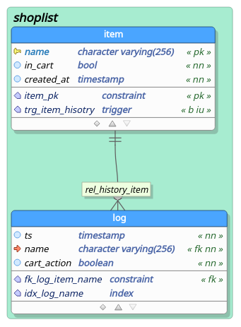

## Level 1 - Shoplist CLI tool

We never know what is missing when we go shopping, and we always forget to buy something! So we've build a small internal system composed of a PostgreSQL instance + frontend to keep track of the items we usually buy and what needs to be shopped. It works well, but we need to automate some things (because we also forget to add things to the list!).

Your assignment is to create a unix-like CLI tool in Node.JS that updates our shopping list by connecting directly to the database and creating/updating the list of known/existing items, and also adds/removes them from shopping list. You can assume all DB-related infrastructure already exists, including users and permissions.

The tool should:
 - Be able to authenticate to the database with credentials from the command line or from environment variables
 - Add or remove items to the cart (by setting `true` or `false` on `"item"."in_cart"`), inserting new lines to this table whenever necessary (e.g. adding an item to the cart that does not yet exist in the table)
 - Get arguments (like item name, etc.) from the command line. It's a bonus if it also gets data from the standard input. 
   - In the case of the standard input, each line should be interpreted as an item in the following format: `ACTION:ITEM_NAME`, where `ACTION` can be either `ADD` or `REMOVE`, and `ITEM_NAME` is the name of the item.

### Database structure

The table `item` keeps track of the existing items, with the `in_cart` column signalizing whether the item is in the shopping list (that is, it needs to be bought) or not. The `log` table has the purpose solely to keep track of the history of actions on the `item` table and is automatically populated with database triggers.

Please also check the content of the [schema](./schema) folder for the SQL definition of the database
